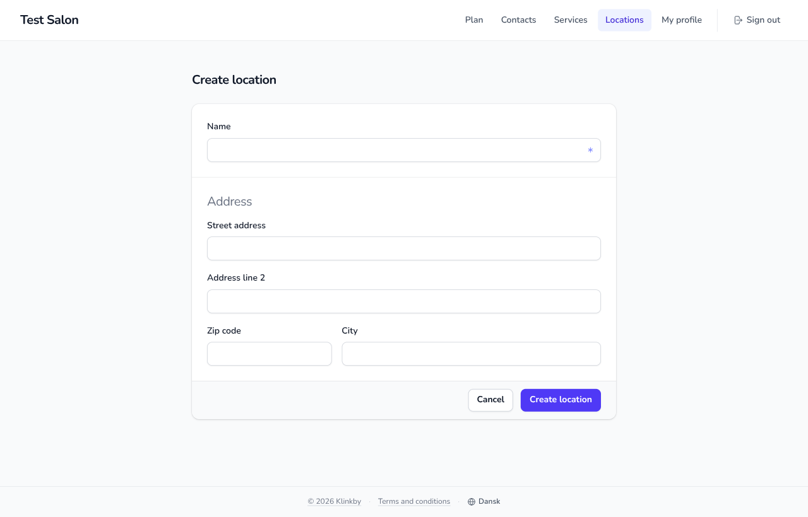

# Design Manual

How the Booqr app looks, and the rules that keep it consistent. Agents get the must-follow summary in
[AGENTS.md › Design System](../AGENTS.md#design-system); this document has the details and the reasons.

> **Status:** approved 2026-10-09 from the _Create location_ mockup below. The app is being migrated to it; until that
> is done, this document describes the target rather than what `main` renders today.




## Principles

- **Standards first**: semantic HTML5 and Tailwind utilities. No custom CSS beyond the `@theme` tokens.
- **Quiet by default**: a grey canvas, white surfaces and one accent colour (indigo). Decoration must carry meaning.
- **Accessible by requirement**: WCAG AA, see [AGENTS.md › Semantic HTML5 & Accessibility](../AGENTS.md#semantic-html5--accessibility-required)
  and the [checklist](#accessibility-checklist) below.
- **Words belong to the product owner**: no new interface text without approval, see [Content](#content).

## Foundations

### Font

[Nunito](https://fonts.google.com/specimen/Nunito) Variable, self-hosted through the `@fontsource-variable/nunito`
package and set as `--font-sans` in the `@theme` block of `src/routes/layout.css`. Never load fonts from a CDN: the
Content-Security-Policy in `lighttpd.conf` is `default-src 'self'`, so the browser would block them.

Weights: **400** body · **600** labels and navigation · **700** headings, buttons and brand. Don't use 500
(`font-medium`): in Nunito it is too close to 400 to carry hierarchy.

### Type scale

| Role                          | Classes                                                                         |
| ----------------------------- | ------------------------------------------------------------------------------- |
| Page title (`<h1>`) and brand | `text-xl font-bold tracking-tight text-gray-900`                                |
| Group heading (`<legend>`)    | `text-xl font-normal tracking-tight text-gray-500`                              |
| Label                         | `text-sm/6 font-semibold text-gray-900`                                         |
| Body and input text           | `text-base sm:text-sm/6` (16px on phones stops iOS from zooming into the field) |
| Navigation                    | `text-sm font-semibold`                                                         |
| Buttons                       | `text-sm font-bold`                                                             |
| Footer                        | `text-xs text-gray-500`                                                         |

### Colour roles

Use Tailwind's palette directly; this table is the contract for what each colour means.

| Role            | Classes                                                    | Notes                                                               |
| --------------- | ---------------------------------------------------------- | ------------------------------------------------------------------- |
| Canvas          | `bg-gray-50`                                               | Page background                                                     |
| Surface         | `bg-white`                                                 | Header, cards, inputs                                               |
| Hairlines       | `border-gray-200`, `ring-gray-900/5`, `divide-gray-900/10` | Borders, card rings, section dividers                               |
| Text            | `text-gray-900`                                            | Primary text                                                        |
| Secondary text  | `text-gray-600`                                            | Navigation, language toggle                                         |
| Muted text      | `text-gray-500`                                            | Footer, group headings. Lightest text allowed (≈4.6:1 on `gray-50`) |
| Accent          | `bg-indigo-600`, hover `bg-indigo-500`                     | Primary buttons                                                     |
| Selected        | `bg-indigo-50 text-indigo-700`                             | Current navigation item                                             |
| Required marker | `text-indigo-400`                                          | Lightest indigo that passes 3:1 for meaningful icons (3.13:1)       |
| Error           | `bg-red-50 text-red-800`                                   | Form error alert (`Form.svelte`)                                    |

### Shape and depth

Controls and buttons are `rounded-lg` with `shadow-xs`; cards are `rounded-xl` with `shadow-sm ring-1 ring-gray-900/5`.
No other shadows.

## Layout

### App shell

`src/routes/+layout.svelte` renders one full-height column, so the footer sits at the bottom of short pages:

```html
<div class="flex min-h-dvh flex-col bg-gray-50">
	<a href="#main-content" class="sr-only focus:not-sr-only focus:fixed focus:z-[60] …">Skip to main content</a>
	<header class="sticky top-0 z-50 border-b border-gray-200 bg-white">…</header>
	<main id="main-content" class="flex-1">…</main>
	<footer class="border-t border-gray-200">…</footer>
</div>
```

- Content container: `mx-auto max-w-7xl px-4 sm:px-6 lg:px-8`.
- The skip link must be `fixed` with a z-index above the header. An `absolute` skip link without one is painted under
  the sticky header and is invisible when focused. Its remaining focus styles:
  `focus:top-3 focus:left-4 focus:rounded-md focus:bg-white focus:px-4 focus:py-2 focus:text-sm focus:font-bold focus:text-indigo-700 focus:shadow-lg focus:ring-1 focus:ring-gray-900/10`

### Header

- **Brand**: the tenant's `displayName` as text, `text-xl font-bold tracking-tight`, truncated when long
  (`min-w-0 truncate`). No monogram or placeholder logo; if the tenant API ever provides a logo, show it with the name
  as `alt`.
- **Navigation**: `<nav aria-label=…>` holding a `<ul>`. Links are
  `rounded-md px-3 py-2 text-sm font-semibold text-gray-600 hover:bg-gray-100 hover:text-gray-900`; the current page adds
  `aria-current="page"` and swaps to `bg-indigo-50 text-indigo-700`.
- **Sign out** is an action, so a `<button>`, set apart from the links by `ml-2 border-l border-gray-200 pl-3` and an
  icon.
- Below `md` the links collapse behind the menu button.

### Page heading

One `<h1>` per page, first in `<main>`, using the page-title style. No back link and no description line by default:
the highlighted navigation item and the Cancel button already lead back.

## Forms

Reference: the approved mockup at the top (`/admin/locations/new`).

- **Card**: a centred column `mx-auto max-w-2xl`; the `<form>` itself is the card,
  `overflow-hidden rounded-xl bg-white shadow-sm ring-1 ring-gray-900/5`.
- **Sections**: separated with `divide-y divide-gray-900/10`, each `px-4 py-5 sm:px-6 sm:py-6`. Related fields go in a
  `<fieldset>` whose `<legend>` uses the group-heading style.
- **Inputs**, placed `mt-1.5` below their label:
  `block w-full rounded-lg border-gray-300 px-3 py-1.5 text-base text-gray-900 shadow-xs placeholder:text-gray-400 focus:border-indigo-600 focus:ring-indigo-600 sm:text-sm/6`
- **Required fields**: the `required` attribute plus an asterisk inside the input's right edge (snippet below). Never
  write "Required" or "Optional", and add hint lines only when the product owner supplies the text.
- **Short values share a row**: `grid grid-cols-6 gap-x-3 gap-y-4 sm:gap-x-4` at every width, e.g. Zip code
  (`col-span-2`, `inputmode="numeric" autocomplete="postal-code"`) next to City (`col-span-4`).
- **Action bar**: the form's last child,
  `flex items-center justify-end gap-3 border-t border-gray-900/10 bg-gray-50 px-4 py-3 sm:px-6`. Cancel (secondary)
  comes first, then a submit button that names the action ("Create location", not "Create"). Both are
  `flex-1 sm:flex-none`, so they split the width on phones.

Required field:

```svelte
<label for="name" class="block text-sm/6 font-semibold text-gray-900">{m.labelName()}</label>
<div class="relative mt-1.5">
	<!-- input classes as above, with pl-3 pr-8 instead of px-3 so text never runs under the asterisk -->
	<input id="name" name="name" type="text" required bind:value={name} class="… pl-3 pr-8" />
	<span aria-hidden="true" class="pointer-events-none absolute inset-y-0 right-3 flex items-center text-indigo-400">
		<svg
			viewBox="0 0 24 24"
			fill="none"
			stroke="currentColor"
			stroke-width="2.5"
			stroke-linecap="round"
			class="size-2.5"
		>
			<path d="M12 3v18M4.2 7.5l15.6 9M4.2 16.5l15.6-9" />
		</svg>
	</span>
</div>
```

The asterisk is `aria-hidden` because screen readers already announce the `required` attribute.

### Buttons

Primary (one per form, the submit action):

```text
inline-flex justify-center rounded-lg bg-indigo-600 px-3.5 py-2 text-sm font-bold text-white shadow-xs
hover:bg-indigo-500 focus-visible:outline-2 focus-visible:outline-offset-2 focus-visible:outline-indigo-600
disabled:cursor-not-allowed disabled:opacity-50
```

Secondary (Cancel and other neutral actions):

```text
inline-flex justify-center rounded-lg bg-white px-3.5 py-2 text-sm font-bold text-gray-900 shadow-xs
ring-1 ring-gray-300 ring-inset hover:bg-gray-50 focus-visible:outline-2 focus-visible:outline-offset-2
focus-visible:outline-indigo-600 disabled:cursor-not-allowed disabled:opacity-50
```

Use `focus-visible`, not `focus`, so keyboard users get a ring and mouse clicks don't leave one behind. Destructive
actions keep the red delete button in `Form.svelte`.

## List pages

### Top row

Put the "Create" button and any filter toggle together in one `flex justify-between items-center` row above the table
(not centered below it). Style both as `bg-transparent border border-gray-300 hover:bg-gray-50` (thin gray border, no
fill) rather than a solid color, for a consistent, low-emphasis action row.

### Filter overlay

Reference: `src/routes/admin/contacts/ContactsFilterForm.svelte` + `src/routes/admin/contacts/+page.svelte`.

Icon-only funnel toggle button (`aria-label`/`aria-expanded`/`aria-controls`) in a `relative` wrapper; the filter
renders as an `absolute right-0 top-full mt-2 z-10` overlay. Use a real form element with `onsubmit` calling
`preventDefault()` then an `onsubmit` prop, so Enter submits and closes the overlay. Debounce free-text inputs 500ms via
a separate `debounced*` state plus `$effect`/`setTimeout`, syncing immediately on submit.

## Footer

One centred line, `text-xs text-gray-500`, with a `border-t border-gray-200` and no background:

> © 2026 Klinkby · Terms and conditions · 🌐 Dansk

- **© 2026 Klinkby** links to the license on GitHub (`https://github.com/klinkby/booqr-app?tab=AGPL-3.0-1-ov-file`).
- **Terms and conditions** (`m.termsAndConditions()`) links to `` `${MARKETING_URL}/terms-and-conditions` ``.
- **Language toggle**: globe icon plus the other language's name in that language (`LanguageToggle`).
- Links are underlined (`underline decoration-gray-300 underline-offset-2`) because they sit next to plain text, where
  colour alone wouldn't mark them. Separators are `·` in `text-gray-300` with `aria-hidden="true"`.

## Content

- **Never invent interface text.** New labels, hints, descriptions, link texts, even screen-reader-only text, need the
  product owner's approval before they go in.
- Reuse existing Paraglide messages in `messages/en.json` and `messages/da.json`; every new string needs both languages.
- English uses sentence case ("My profile", "Zip code", "Create location"). Danish already does.
- Buttons name their action: a verb plus its object ("Create location").

## Accessibility checklist

[AGENTS.md › Semantic HTML5 & Accessibility](../AGENTS.md#semantic-html5--accessibility-required) is binding. On top of
it, the design adds these floors:

- Text contrast ≥ 4.5:1, so nothing lighter than `text-gray-500`.
- Meaningful icons ≥ 3:1 (WCAG 1.4.11), so on white nothing lighter than `text-indigo-400` or `text-gray-500/80`.
- Never rely on colour alone: the current navigation item also has `aria-current`, and links next to text are
  underlined.
- Focus must stay visible: `focus-visible:outline-*` on controls, and the skip link stacks above the sticky header.
