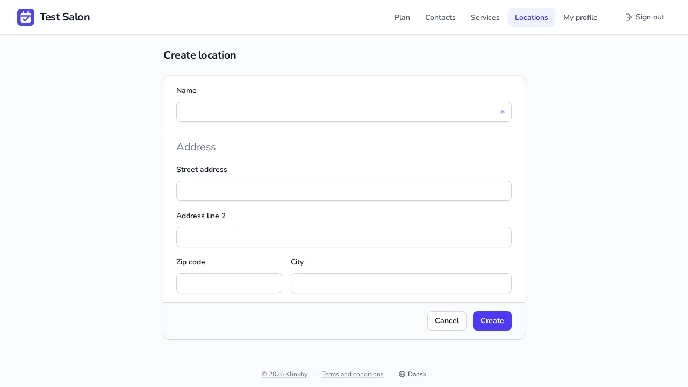
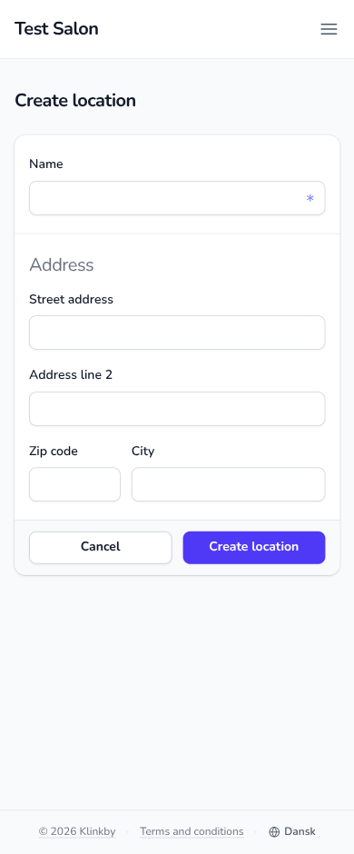

# Design Manual

How the Booqr app looks, and the rules that keep it consistent. Agents get the must-follow summary in
[AGENTS.md › Design System](../AGENTS.md#design-system); this document has the details and the reasons.

> **Status:** approved 2026-10-09. The app shell (header, footer, font) and _Create location_ (`/admin/locations/[id]`)
> are migrated and are the reference implementation. Other pages still use older classes; migrate them with
> [Migrating a form](#migrating-a-form) rather than copying from them.





## Principles

- **Standards first**: semantic HTML5 and Tailwind utilities. No custom CSS beyond the `@theme` tokens.
- **One source per class string**: shared class strings live in `src/lib/ui.js` (`label`, `input`, `checkbox`, `radio`, `choiceLabel`,
  `groupHeading`, `link`, `alert`, `card`, `cardSection`, `buttonPrimary`, `buttonSecondary`, `iconButtonSecondary`,
  `buttonDanger`) and in components (`Form`, `RequiredInput`, `RequiredMark`, `PhoneInput`, `LimitedTextarea`,
  `DataTable`, `PaginatedTable`, `NavBar`, `LanguageToggle`). Import them; never paste a copy into a page. A new pattern used twice becomes a token.
- **Quiet by default**: a grey canvas, white surfaces and one accent colour (indigo). Decoration must carry meaning.
- **Accessible by requirement**: WCAG AA, see [AGENTS.md › Semantic HTML5 & Accessibility](../AGENTS.md#semantic-html5--accessibility-required)
  and the [checklist](#accessibility-checklist) below.
- **Words belong to the product owner**: no new interface text without approval, see [Content](#content).

## Foundations

### Font

[Nunito](https://fonts.google.com/specimen/Nunito) Variable, self-hosted through the `@fontsource-variable/nunito`
package and set as `--font-sans` in the `@theme` block of `src/routes/layout.css`. Never load fonts from a CDN: the
Content-Security-Policy in `lighttpd.conf` is `default-src 'self'`, so the browser would block them.

Weights: **400** body · **600** labels and navigation · **700** headings, buttons and brand. Don't use 500
(`font-medium`): in Nunito it is too close to 400 to carry hierarchy.

### Type scale

| Role                          | Classes                                                                         |
| ----------------------------- | ------------------------------------------------------------------------------- |
| Page title (`<h1>`) and brand | `text-xl font-bold tracking-tight text-gray-900`                                |
| Group heading (`<legend>`)    | `text-xl font-normal tracking-tight text-gray-500`                              |
| Label                         | `text-sm/6 font-semibold text-gray-900`                                         |
| Body and input text           | `text-base sm:text-sm/6` (16px on phones stops iOS from zooming into the field) |
| Navigation                    | `text-sm font-semibold`                                                         |
| Buttons                       | `text-sm font-bold`                                                             |
| Footer                        | `text-xs text-gray-500`                                                         |

### Colour roles

Use Tailwind's palette directly; this table is the contract for what each colour means.

| Role            | Classes                                                    | Notes                                                               |
| --------------- | ---------------------------------------------------------- | ------------------------------------------------------------------- |
| Canvas          | `bg-gray-50`                                               | Page background                                                     |
| Surface         | `bg-white`                                                 | Header, cards, inputs                                               |
| Hairlines       | `border-gray-200`, `ring-gray-900/5`, `divide-gray-900/10` | Borders, card rings, section dividers                               |
| Text            | `text-gray-900`                                            | Primary text                                                        |
| Secondary text  | `text-gray-600`                                            | Navigation, language toggle                                         |
| Muted text      | `text-gray-500`                                            | Footer, group headings. Lightest text allowed (≈4.6:1 on `gray-50`) |
| Accent          | `bg-indigo-600`, hover `bg-indigo-500`                     | Primary buttons                                                     |
| Selected        | `bg-indigo-50 text-indigo-700`                             | Current navigation item                                             |
| Required marker | `text-indigo-400`                                          | Lightest indigo that passes 3:1 for meaningful icons (3.13:1)       |
| Error           | `bg-red-50 text-red-800`                                   | Form error alert (`Form.svelte`)                                    |

### Spacing

Vertical gaps use three steps only:

| Step | Tailwind | Where                                                                                       |
| ---- | -------- | ------------------------------------------------------------------------------------------- |
| 8px  | `2`      | Label → its control (`mb-2` is part of the `label` token)                                   |
| 16px | `4`      | Between fields, legend → its fields, toolbar → table, card section/action bar/alert padding |
| 24px | `6`      | Page padding (`main`), page heading → content, between page-level blocks                    |

Header and footer heights are fixed by the shell. Don't use `1.5`, `3`, `5`, `8` or `12` steps
for vertical spacing; horizontal gutters follow [Layout](#layout).

### Shape and depth

Controls and buttons are `rounded-lg` with `shadow-xs`; cards are `rounded-xl` with `shadow-sm ring-1 ring-gray-900/5`
(`card`). Floating overlays (the filter panel) use `shadow-lg` to lift off the page. No other shadows.

## Layout

### App shell

`src/routes/+layout.svelte` renders one full-height column, so the footer sits at the bottom of short pages:

```html
<div class="flex min-h-dvh flex-col bg-gray-50">
	<a href="#main-content" class="sr-only focus:not-sr-only focus:fixed focus:z-[60] …">Skip to main content</a>
	<header class="sticky top-0 z-50 border-b border-gray-200 bg-white">…</header>
	<main id="main-content" class="flex-1">…</main>
	<footer class="border-t border-gray-200">…</footer>
</div>
```

- Content container: `mx-auto max-w-7xl px-4 py-6 sm:px-6 lg:px-8`; the header and footer share its gutters.
- The skip link must be `fixed` with a z-index above the header. An `absolute` skip link without one is painted under
  the sticky header and is invisible when focused. Its remaining focus styles:
  `focus:top-3 focus:left-4 focus:rounded-md focus:bg-white focus:px-4 focus:py-2 focus:text-sm focus:font-bold focus:text-indigo-700 focus:shadow-lg focus:ring-1 focus:ring-gray-900/10`

### Header

`NavBar.svelte`; the root layout passes `brandName`, `links` and `onlogout`.

- **Brand**: the tenant's `displayName` as text, `text-xl font-bold tracking-tight`, truncated when long
  (`min-w-0 truncate`). No monogram or placeholder logo; if the tenant API ever provides a logo, show it with the name
  as `alt`.
- **Navigation**: `<nav aria-label=…>` holding a `<ul>`. Links are
  `rounded-md px-3 py-2 text-sm font-semibold text-gray-600 hover:bg-gray-100 hover:text-gray-900`; the current page adds
  `aria-current="page"` and swaps to `bg-indigo-50 text-indigo-700`.
- **Sign out** is an action, so a `<button>`, set apart from the links by `ml-2 border-l border-gray-200 pl-3` and an
  icon.
- Below `md` the links collapse behind the menu button.

### Page heading

One `<h1>` per page, first in `<main>`, page-title style plus `mb-6`. No back link and no description line: the
highlighted navigation item and the Cancel button already lead back.

The root layout owns it: `titleFromPath()` in `src/routes/+layout.svelte` maps the route to a `title*` message, which
becomes both the `<h1>` and the `<title>`. Pages it maps must not render their own `<h1>`; pages it doesn't map (home,
booking wizard) render their own. Form routes (`isFormPage`: `admin/<resource>/<id>`, `login`,
`change-password`) are wrapped in the centred `mx-auto max-w-2xl` column, heading included.

## Forms

Reference: `src/routes/admin/locations/[id]/+page.svelte` (screenshots at the top).

- **Card**: `<Form card …>` renders the white card (`rounded-xl shadow-sm ring-1 ring-gray-900/5`), the error alert,
  the divided sections and the action bar. Without `card`, `Form` keeps the old plain layout for forms not yet migrated.
- **Sections**: each direct child of `Form` is a `<div class={cardSection}>`; `Form` draws the dividers between them.
  Related fields go in a `<fieldset>` whose `<legend class={groupHeading}>` names the group.
- **Fields**: `<label class={label}>` then `<input class={input}>`; the label's `mb-2` makes the gap.
- **Required fields**: `<RequiredInput id=… name=… bind:value />` sets `required` and draws the `aria-hidden` asterisk
  (`text-indigo-400`) inside the input's right edge; screen readers announce the attribute. Never write "Required" or
  "Optional", and add hint lines only when the product owner supplies the text.
- **Short values share a row**: `grid grid-cols-6 gap-x-3 gap-y-4 sm:gap-x-4` at every width, e.g. Zip code
  (`col-span-2`, `inputmode="numeric" autocomplete="postal-code"`) next to City (`col-span-4`).
- **Action bar** (drawn by `Form`): Cancel, then the submit button: `m.create()` when creating,
  `m.update()` when editing (the page heading already names the object). On phones both split the width.

### Buttons

Use the tokens in `src/lib/ui.js`: `buttonPrimary` (one per form, the submit action), `buttonSecondary` (Cancel and
other neutral actions) and `buttonDanger` (destructive). All are `rounded-lg text-sm font-bold shadow-xs` with a
`focus-visible` outline, so keyboard users get a ring and mouse clicks don't leave one behind.

### Migrating a form

1. Pass `card` to `Form`; drop the page's own width wrapper (the layout centres form routes) and any `mt-*` above it.
2. Wrap each group of fields in `<div class={cardSection}>`; use a `<fieldset>` + `groupHeading` legend for groups
   the old page already labels (reuse its message, don't invent a heading).
3. Swap label/input class lists for `label` / `input`, and required inputs for `RequiredInput`.
4. Put short related values in the six-column grid.
5. Submit label: `m.create()` / `m.update()`; for anything else, keep the current label.
6. Update e2e selectors and screenshots (`npm run test:e2e`) and compare with the reference page.

## List pages

### Top row

Put the "Create" button and any filter toggle together in one `flex justify-between items-center` row above the table
with `mb-4` (not centered below it). Both are secondary buttons: `buttonSecondary` for "Create", `iconButtonSecondary` for the
icon-only filter toggle (`src/lib/ui.js`). Low emphasis; the solid indigo button is reserved for a form's submit.

### Table

`PaginatedTable` → `DataTable` renders the table as a `card`: grey header row (`bg-gray-50`, `text-sm font-semibold`),
rows divided with `divide-gray-900/10`, cells `px-4 py-4 sm:px-6`, actions right-aligned (Edit uses `link`, Delete is red
text). Previous/Next sit in a grey bar inside the card's bottom edge, like a form's action bar. Loading and empty
states are a `card` with `text-sm text-gray-500`; errors use `alert`. Pages don't style tables themselves.

### Filter overlay

Reference: `src/routes/admin/contacts/ContactsFilterForm.svelte` + `src/routes/admin/contacts/+page.svelte`.

Icon-only funnel toggle button (`aria-label`/`aria-expanded`/`aria-controls`) in a `relative` wrapper; the filter
renders as an `absolute right-0 top-full z-10 mt-2 w-72 rounded-xl bg-white p-4 shadow-lg ring-1 ring-gray-900/5` panel
with `label`/`input`/`checkbox` fields spaced `space-y-4`. Use a real form element with `onsubmit` calling
`preventDefault()` then an `onsubmit` prop, so Enter submits and closes the overlay. Debounce free-text inputs 500ms via
a separate `debounced*` state plus `$effect`/`setTimeout`, syncing immediately on submit.

## Footer

One centred line, `text-xs text-gray-500`, with a `border-t border-gray-200` and no background:

> © 2026 Klinkby · Terms and conditions · 🌐 Dansk

- **© 2026 Klinkby** links to the license on GitHub (`https://github.com/klinkby/booqr-app?tab=AGPL-3.0-1-ov-file`).
- **Terms and conditions** (`m.termsAndConditions()`) links to `` `${MARKETING_URL}/terms` ``, as does the sign-up
  checkbox on the booking confirm page.
- **Language toggle**: globe icon plus the other language's name in that language (`LanguageToggle`).
- Links are underlined (`underline decoration-gray-300 underline-offset-2`) because they sit next to plain text, where
  colour alone wouldn't mark them. Separators are `·` in `text-gray-300` with `aria-hidden="true"`.

## Content

- **Never invent interface text.** New labels, hints, descriptions, link texts, even screen-reader-only text, need the
  product owner's approval before they go in.
- Reuse existing Paraglide messages in `messages/en.json` and `messages/da.json`; every new string needs both languages.
- English uses sentence case ("My profile", "Zip code", "Create location"). Danish already does.
- Buttons are verbs. Form submits use `m.create()` / `m.update()`; list-page buttons that stand alone name their
  object (`m.createLocation()`).

## Accessibility checklist

[AGENTS.md › Semantic HTML5 & Accessibility](../AGENTS.md#semantic-html5--accessibility-required) is binding. On top of
it, the design adds these floors:

- Text contrast ≥ 4.5:1, so nothing lighter than `text-gray-500`.
- Meaningful icons ≥ 3:1 (WCAG 1.4.11), so on white nothing lighter than `text-indigo-400` or `text-gray-500/80`.
- Never rely on colour alone: the current navigation item also has `aria-current`, and links next to text are
  underlined.
- Focus must stay visible: `focus-visible:outline-*` on controls, and the skip link stacks above the sticky header.
